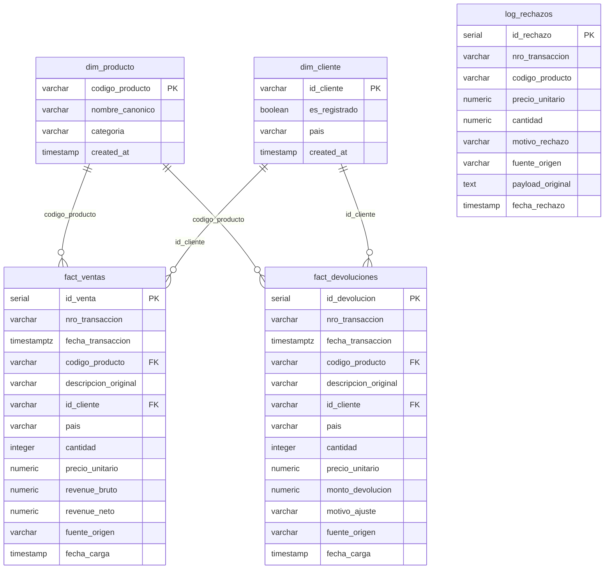

# Modelo de Datos - DataMart S.A.S.

## Diagrama Entidad-Relación (Esquema Estrella)

```mermaid
erDiagram
    dim_producto ||--o{ fact_ventas : "codigo_producto"
    dim_producto ||--o{ fact_devoluciones : "codigo_producto"
    dim_cliente ||--o{ fact_ventas : "id_cliente"
    dim_cliente ||--o{ fact_devoluciones : "id_cliente"

    dim_producto {
        varchar codigo_producto PK
        varchar nombre_canonico
        varchar categoria
        timestamp created_at
    }

    dim_cliente {
        varchar id_cliente PK
        boolean es_registrado
        varchar pais
        timestamp created_at
    }

    fact_ventas {
        serial id_venta PK
        varchar nro_transaccion
        timestamptz fecha_transaccion
        varchar codigo_producto FK
        varchar descripcion_original
        varchar id_cliente FK
        varchar pais
        integer cantidad
        numeric precio_unitario
        numeric revenue_bruto
        numeric revenue_neto
        varchar fuente_origen
        timestamp fecha_carga
    }

    fact_devoluciones {
        serial id_devolucion PK
        varchar nro_transaccion
        timestamptz fecha_transaccion
        varchar codigo_producto FK
        varchar descripcion_original
        varchar id_cliente FK
        varchar pais
        integer cantidad
        numeric precio_unitario
        numeric monto_devolucion
        varchar motivo_ajuste
        varchar fuente_origen
        timestamp fecha_carga
    }

    log_rechazos {
        serial id_rechazo PK
        varchar nro_transaccion
        varchar codigo_producto
        numeric precio_unitario
        numeric cantidad
        varchar motivo_rechazo
        varchar fuente_origen
        text payload_original
        timestamp fecha_rechazo
    }
```
